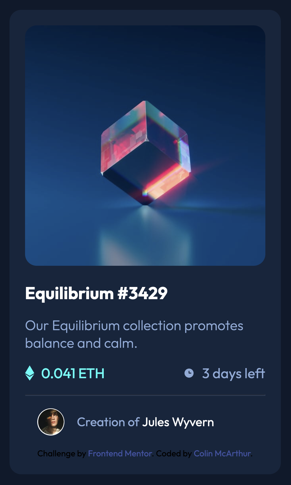

# Frontend Mentor - NFT preview card component solution

This is a solution to the [NFT preview card component challenge on Frontend Mentor](https://www.frontendmentor.io/challenges/nft-preview-card-component-SbdUL_w0U). Frontend Mentor challenges help you improve your coding skills by building realistic projects.

## Table of contents

- [Overview](#overview)
  - [The challenge](#the-challenge)
  - [Screenshot](#screenshot)
  - [Links](#links)
- [My process](#my-process)
  - [Built with](#built-with)
  - [What I learned](#what-i-learned)
  - [Continued development](#continued-development)
  - [Useful resources](#useful-resources)
- [Author](#author)
- [Acknowledgments](#acknowledgments)

## Overview

### The challenge

This is my solution to Frontend Mentor's NFT preview card component challenge. The challenge was to recreate this card as close as possible to the original design while keeping it fully responsive on all devices - https://www.frontendmentor.io/challenges/nft-preview-card-component-SbdUL_w0U.

### Screenshot



### Links

- Solution URL: [View my code here](https://github.com/ColinMcArthur85/nft_card_component)
- Live Site URL: [View the live site here](https://colinmcarthur85.github.io/nft_card_component/)

## My process

### Built with

- Semantic HTML5 markup
- CSS custom properties
- Flexbox
- Mobile-first workflow
- Pseudo elements
- Responsive layout

### What I learned

Every time I do one of these projects my first impressions are always 'this should be pretty straight-forward' and then I am immediatly humbled by something along the way. This project taught me a few things. I was concious in trying to keep my code as 'clean' and 'organized' as possible which is a challenge on its own. I attempted to stick with the B.E.M. naming method to support this goal while also did my best to keep my nesting as effective as possible.

I also used pseudo elements for the mouseover effect which I have not done prior to this. That was a little challenging to get working properly and Im still wondering if there is a more effective way to solve this issue.

Lastly, learning from a previous project, my effort was to not recreate this as 'pixel perfect' as possible, rather, to create the card to be responsive through all devices while still serving the designers requests.

Fun!

Below is some example of my efforts in keeping this project as streamlined as possible:

```html
<div class="card__content">
  <h1 class="card__content__title">
    <a href="">Equilibrium #3429</a>
  </h1>
  <p class="card__content__body">
    Our Equilibrium collection promotes balance and calm.
  </p>
  <div class="card__eth__time">
    <div class="card__eth">
      
      <p>0.041 ETH</p>
    </div>
    <div class="card__time">
      
      <p>3 days left</p>
    </div>
  </div>
</div>
```

```css
:root {
  --clr-soft-blue: hsl(215, 51%, 70%);
  --clr-cyan: hsl(178, 100%, 50%);
  --clr-dark-blue-main: hsl(217, 54%, 11%);
  --clr-dark-blue-card: hsl(216, 50%, 16%);
  --clr-dark-blue-line: hsl(215, 32%, 27%);
  --clr-white: hsl(0, 0%, 100%);
  --font-weight-1: 100;
  --font-weight-2: 200;
  --font-weight-3: 300;
  --font-weight-4: 400;
  --font-weight-5: 500;
  --font-weight-6: 600;
  --font-weight-7: 700;
}
```

### Continued development

I feel like Id like to have another crack at the mouseover image overlay concept. I think with the next project that Im going to take an extra 10-15 minutes before starting it and come up with a gameplan for nameing classes. While I used B.E.M., I think I could have done a better job by taking the time to plan ahead rather than coming up with the names on the spot.

## Author

- Gitbub - [Add your name here](https://github.com/ColinMcArthur85)
- Frontend Mentor - [@yourusername](https://www.frontendmentor.io/profile/ColinMcArthur85)
